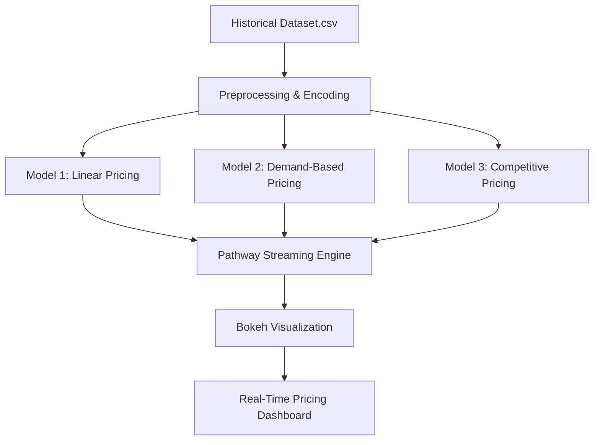

# Dynamic Pricing Engine for Urban Parking Spaces

> Capstone Project | Summer Analytics 2025> By: [Gyan Chelani]> Hosted by: Consulting & Analytics Club x Pathway

---

## Overview

This project implements a **real-time dynamic pricing engine** for 14 urban parking lots using streaming data, demand modeling, and competitive strategies.

### Objectives:

- Efficiently manage urban parking via real-time pricing
- Use ML-inspired demand models (built with only `numpy`, `pandas`)
- Simulate real-time data with `Pathway`
- Visualize using `Bokeh`

### Outcome:

Three pricing models were implemented:

1. **Model 1**: Linear price based on occupancy
2. **Model 2**: Demand-based dynamic pricing
3. **Model 3**: Competitive pricing considering nearby lots

---

##  Tech Stack

| Tool           | Purpose                           |
| -------------- | --------------------------------- |
| `Python`       | Core programming                  |
| `pandas`       | Data manipulation                 |
| `numpy`        | Mathematical computations         |
| `Pathway`      | Real-time streaming simulation    |
| `Bokeh`        | Live data visualization           |
| `Mermaid`      | Architecture diagram              |
| `Google Colab` | Execution and simulation notebook |

---

## Project Architecture and Workflow



---

##  Model Details

###  Model 1: Baseline Linear Pricing

- Price = Base Price + α * (Occupancy / Capacity)
- α = 5.0, smooth and simple logic

###  Model 2: Demand-Based Pricing

- Factors: Occupancy, Queue, Traffic, Vehicle Type, Special Days
- Price = Base Price * (1 + λ * Normalized Demand)
- Prices clipped between 0.5x and 2x

### Model 3: Competitive Pricing

- Adds competitor lot prices using geo-proximity
- Rerouting or price drops if competitor is cheaper and nearby

---

##  Repository Structure

```
─ README.md
─ parking_stream_model2.csv
─ parking_stream_model3.csv
─ Modified_Model1_Notebook.ipynb
─ Modified_Model2_Notebook.ipynb
─ Modified_Model3_Notebook.ipynb

```

---

##  How to Run

1. Upload the required `.csv` and `.ipynb` notebooks to Google Colab
2. Install dependencies:

```python
!pip install pathway bokeh
```

3. Run the notebook cell-by-cell
4. View Bokeh plots at the end (served via Panel)

---

##  Assumptions Made

- **Vehicle Weight**: car=1.0, bike=0.7, truck=1.3
- **Traffic Score**: low=0.3, medium=0.6, high=1.0
- **Competitor Pricing**: simulated by calculating average price of lots within 1km
- **Demand Normalization**: demand scores are normalized crudely assuming max ~10
- **Occupancy Threshold**: 90%+ triggers rerouting suggestion
- **All models are independent per parking lot** for simplicity

---

##  Demand Function Summary

### Model 2:
```text
Demand =
  α * (Occupancy / Capacity)
+ β * QueueLength
- γ * TrafficScore
+ δ * IsSpecialDay
+ ε * VehicleWeight
```
- Price = Base * (1 + λ * NormalizedDemand)
- Prices are clipped between [0.5x, 2x] base price

### Model 3:
- Same demand function + pricing influenced by nearby competitor prices
- Adjusts price down if competitor is cheaper and nearby

---

##  Final Notes

- All models are built from scratch 
- Pricing logic is clean, interpretable, and justifiable
- Real time simulation reflects deployment-ready mindset
- Report and notebooks are fully documented

---


